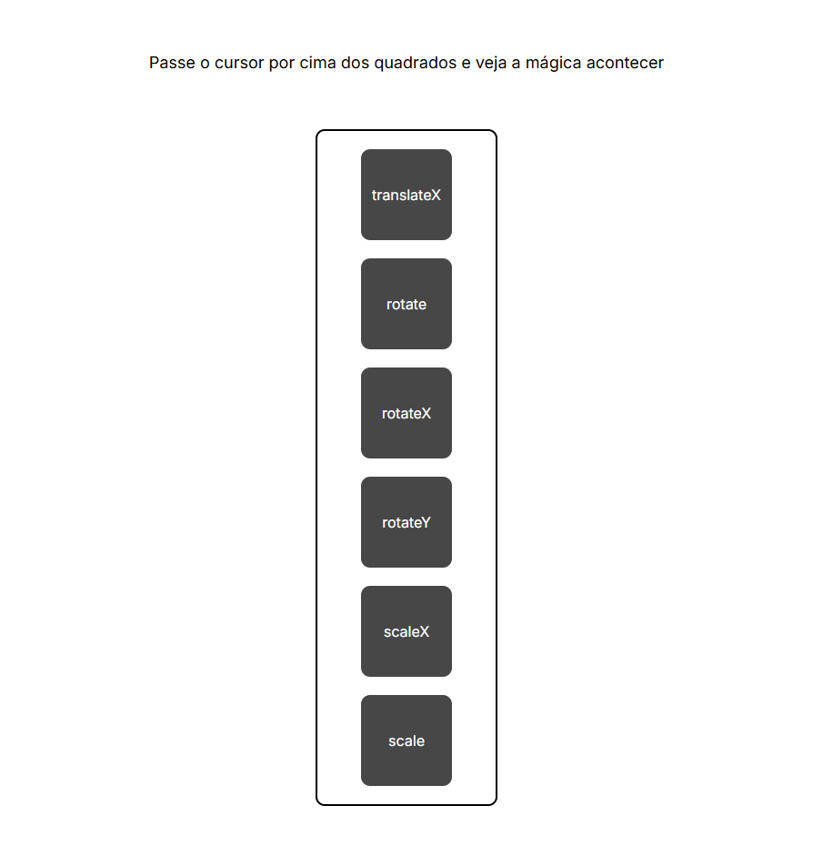

# 🎨 Hover - Transform CSS

Este projeto demonstra a utilização de transformações CSS com `:hover` para aplicar animações visuais em elementos HTML. Ao passar o cursor sobre os cartões na tela, diferentes transformações são executadas, como rotação, escala e translação.

## 📸 Captura de Tela

  

Visualize a página:  
👉 [Clique aqui para acessar](https://ivannatech.github.io/hover-transform)

---

## 🧰 Tecnologias Utilizadas

- **HTML5**  
- **CSS3** (`transform`, `transition`)
- **Google Fonts** - Inter

---

## 💡 Funcionalidades

Cada cartão aplica uma transformação diferente quando o usuário passa o mouse sobre ele:

- `translateX(100px)` - Desloca o cartão horizontalmente
- `rotate(360deg)` - Rotaciona no eixo Z
- `rotateX(360deg)` - Rotaciona no eixo X
- `rotateY(360deg)` - Rotaciona no eixo Y
- `scaleX(1.5)` - Escala horizontalmente
- `scale(1.3)` - Escala proporcionalmente

---

## 👩‍💻 Autoria

Desenvolvido por **Ivanna Tech (Ivanna Almeida)**  
🔗 [GitHub](https://github.com/ivannatech)

---

## 📄 Licença

Este projeto está sob a licença MIT.  
Consulte o arquivo `LICENSE` para mais informações.
